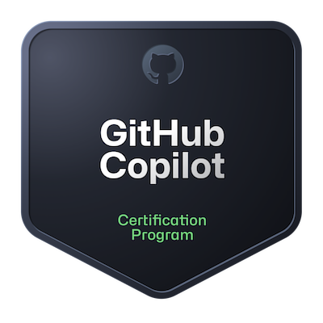

## Hi there 👋
### Certifications
<table>
  <tr>
    <td style="width: 40%; vertical-align: top;">
      
    </td>
    <td style="vertical-align: top;">
      <ul>
        <li>- Responsible AI</li>
        <li>- GitHub Copilot plans and features</li>
        <li>- How GitHub Copilot works and handles data</li>
        <li>- Prompt Crafting and Prompt Engineering</li>
        <li>- Developer use cases for AI</li>
        <li>- Testing with GitHub Copilot</li>
        <li>- Privacy fundamentals and content exclusions</li>
      </ul>
    </td>
  </tr>
  <tr>
      <a href="https://www.credly.com/badges/ab86e257-bff4-4de6-af57-48bb99875471/public_url">View</a>
  </tr>
</table>
  
---

- 🔭 I’m currently working on [AI Innovation Challenge June 2025](https://womenincloud.com/aichallenge/)
- 🌱 I’m currently learning [Microsoft Copilot Studio](https://learn.microsoft.com/en-us/microsoft-copilot-studio/) and [Azure AI Foundry](https://learn.microsoft.com/en-us/azure/ai-foundry/what-is-azure-ai-foundry)
- 👯 I’m looking to collaborate on Agentic Solutions for Non-profits

<!--
**CarnegieJ/CarnegieJ** is a ✨ _special_ ✨ repository because its `README.md` (this file) appears on your GitHub profile.

Here are some ideas to get you started:

- 🔭 I’m currently working on [AI Innovation Challenge June 2025](https://womenincloud.com/aichallenge/)
- 🌱 I’m currently learning [Microsoft Copilot Studio](https://learn.microsoft.com/en-us/microsoft-copilot-studio/) and [Azure AI Foundry](https://learn.microsoft.com/en-us/azure/ai-foundry/what-is-azure-ai-foundry)
- 👯 I’m looking to collaborate on Agentic Solutions for Non-profits
- 🤔 I’m looking for help with ...
- 💬 Ask me about ...
- 📫 How to reach me: ...
- 😄 Pronouns: ...
- ⚡ Fun fact: ...
-->
